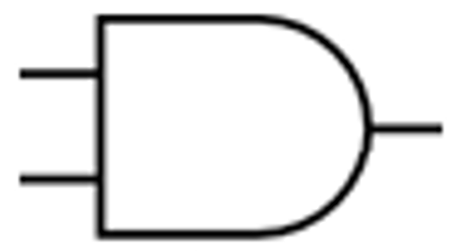

**Question:** What is an AND gate?  
**Answer:** An AND gate is a digital logic gate that outputs true (1) only when both of its inputs are true (1). Otherwise, it outputs false (0).

**Truth Table:**  
The truth table for an AND gate is as follows:

| P | Q | Result |
| :-: | :-: | :-: |
| 0 | 0 | 0 |
| 0 | 1 | 0 |
| 1 | 0 | 0 |
| 1 | 1 | 1 |

**Math Representation:**  
The output of the AND gate can be mathematically expressed as $r = p \cdot q$, where $p$ and $q$ are the inputs.

**Symbol Representation:**  

**Properties:**  
1. [Associative binary property](Associative%20binary%20property.md)
2. [Communicative binary property](Communicative%20binary%20property.md)
3. [Distributive binary property](Distributive%20binary%20property.md) with [OR gate](OR%20gate.md)
4. [Absorptive property](Absorptive%20property.md) with [OR gate](OR%20gate.md)
