[Batteries Project](../projects/Batteries%20Project.md)
[Rynek Energii w Polsce](Rynek%20Energii%20w%20Polsce.md)

## Glossary

**Balancing Services Provider** (BSP, pl: dostawca usług bilansujących) – an active participant in the balancing market, owner of assets qualified to provide balancing capacity and/or energy to the TSO (or an aggregator authorized by such owner to manage their assets in the field of balancing services).

**Balancing capacity** (unit: MW, pl: moc bilansująca) – the volume of capacity reserve kept by the asset operator to provide balancing energy upon demand from the TSO.

**Balancing energy** (unit: MWh, pl: energia bilansująca) – the volume of energy used by the TSO to balance the grid at the moment of delivery.

**Scheduling unit** (pl: jednostka grafikowa) – the basic identification and settlement unit in the balancing services market, a set of generation assets used by the BSP to provide the services.

**Qualification** – the process of licensing a scheduling unit for the balancing market, covering, among other things, assets' control and regulation systems and integration with TSO's IT systems.

## Current State

Since June 2024:

- The balancing services market is fully competitive and open to renewable energy sources (RES) as well.
- The balancing time interval has shifted to 15 minutes (previously 1 hour).

## Balancing Services

All services will have upward ($G$) and downward ($D$) regulation demands. For example, $FCR_g$ is a product that represents upward regulation demand (generation increase).

| Reserve Type | Activation Time | Estimated Hourly System Demand |
| ------------ | --------------- | ------------------------------- |
| FCR          | 30 s            | $G$: 170 MW; $D$: 170 MW        |
| aFRR         | ≤ 5 min         | $G$: 400 MW; $D$: 240 MW        |
| mFRR         | ≤ 12.5 min      | $G$: 600 MW; $D$: 360 MW        |
| RR           | ≤ 30 min        | –                               |

- **FCR**: Frequency Containment Reserve
- **FRR**: Frequency Restoration Reserve
- **aFRR**: Automatic FRR
- **mFRR**: Manual FRR
- **RR**: Replacement Reserve

## Scheduling Unit Types for RES

*(Description to be filled if required, please provide details.)*

## Scheduling Unit Types for BESS

*(Description to be filled if required, please provide details.)*

## Market Design

The balancing capacity market comprises the following phases:

- **Primary** – day-ahead trading with a single pay-as-cleared auction for the entire day, offers in full MWs in hourly granularity.
- **Secondary** – intraday trading with hour-specific pay-as-cleared auctions, offers in full MWs in 15-minute granularity.

### Trading Schedule – Spot and Balancing Markets

| Time                | Event                                                                             |
| ------------------- | --------------------------------------------------------------------------------- |
| 07:30 (d-1)         | Publication of grid limits                                                        |
| 8:30-9:00 (d-1)     | Initial capacity auctions                                                         |
| 9:00-10:00 (d-1)    | Verification of capacity offers, initial auction results publication              |
| 10:00-14:30 (d-1)   | Initial scheduling phase (including balancing energy offers)                      |
| 10:30 (d-1)         | Day-ahead spot auction I                                                          |
| 12:00 (d-1)         | Day-ahead spot auction II                                                         |
| 14:00 (d-1) – 22:15 | Intraday spot market (ending 45 mins before delivery hour)                       |
| 16:30 (d-1) – 22:05 | Secondary capacity and energy auctions (ending 55 mins before delivery hour)     |

### Market Timeline as a Chart

```mermaid
gantt
    title Energy Market Timeline
    dateFormat HH:mm
    axisFormat %H:%M
    section Day Before (d-1)
    Publication of grid limits       : milestone, 07:30, 07:30
    Initial capacity auctions        : 08:30, 09:00
    Verification of capacity offers  : 09:00, 10:00
    Initial scheduling phase         : 10:00, 14:30
    Day-ahead spot auction I         : milestone, 10:30, 10:30
    Day-ahead spot auction II        : milestone, 12:00, 12:00
    Intraday spot market             : 14:00, 22:15
    Secondary capacity & energy auctions : 16:30, 22:05
```

