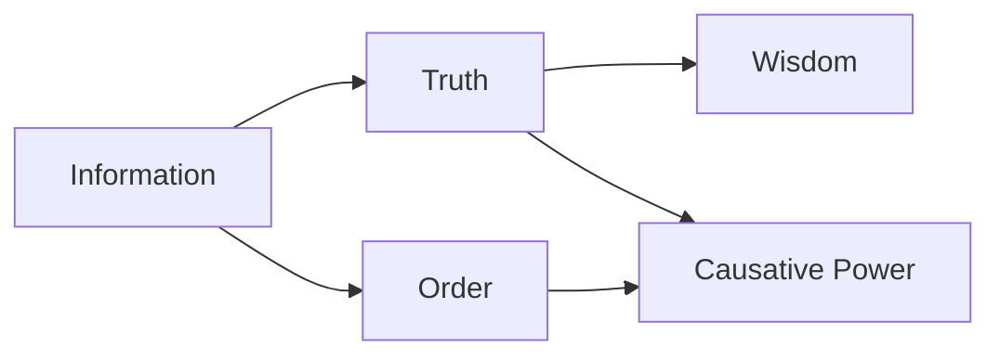

There are many ways to view information and how it is impactful. In the book, author thinks that most accurate way is to view it as:

And the story goes like this:

1. Bureaucracy if necessary to have order but limits the truth.
    Creates silos of knowledge, false taxonomies
2. Bureaucracy dictates what is developed.
3. Order gives a lot of Causative Power but does not imply wisdom

Extreme Example: Nazi Germany had a lot of order and thus causative power but
because it was not founded in truth (they believed in false theory that their
race is better) they did not have much wisdom on their side. As in: had they had
wisdom, they might have applied their efforts to not murder, but progress
instead. However: notice that they had a lot of brilliant scientists that did
know how to do progress. It's just that the progress was directed to the goal
set by the bureaucracy.
