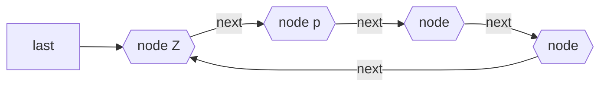

## Definition

An extension of [Singly Linked List](Singly%20Linked%20List.md) that allows for insertions at the beginning as well as at the end without extra pointer for "end". Also called Singly Linked Ring.

## Notation

