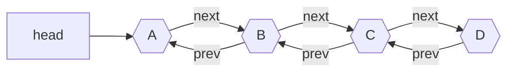

## Definition

An extension of [Singly Linked List](Singly%20Linked%20List.md). Difference is that each node holds `data`, `next` pointer AND `prev` pointer. This makes any algorithm modifying the doubly linked list MUCH easier than in singly linked list.

## Notation

