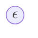
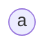
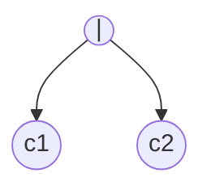
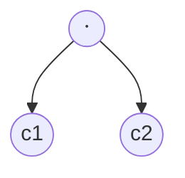
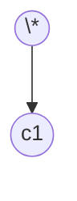

This note is a rendered set of rules for [ECOTE](../projects/ECOTE/ECOTE.md)

## Node types

- $\epsilon$ node

- non-$\epsilon$ node

- **or** node

- **concat** node

- **closure** node

## Functions

- **Null-able(n) Algorithm**
  - **ε node at i position**: **true**
  - **Non-ε node at i position**: **false**
  - **Or node**: `null-able(c1) $\vee$ null-able(c2)`
  - **Concat node**: `null-able(c1) $\wedge$ null-able(c2)`
  - **Closure node**: **true**

- **first(n) Algorithm**
  - **ε node at i position**: return $\emptyset$
  - **Non-ε node at i position**: return $i$
  - **Or node**: first(c1) $\cup$ first(c2)
  - **Concat node**: nullable(c1) ? (first(c1) $\cup$ first(c2)) : first(c1)
  - **Closure node**: first(c1)

- **last(n) Algorithm**
  - **ε node at i position**: return $\emptyset$
  - **Non-ε node at i position**: return $i$
  - **Or node**: last(c1) $\cup$ last(c2)
  - **Concat node**: nullable(c2) ? (last(c1) $\cup$ last(c2)) : last(c2)
  - **Closure node**: last(c1)

- **follow(i) Algorithm** (this is unfinished, but just follow a common sense :/ )
  - **ε node at i position**:
  - **Non-ε node at i position**:
  - **Or node**:
  - **Concat node**:
  - **Closure node**:

## Building DFA directly from RE

Define empty set "Dstates"
Define empty table "Dtran"
Define initial state "A" = first(root) (this will be a set of positions (leafs))
Add "A" to "Dstates"

for each of the input symbols (we will generalize the input symbol to "a")
    define new set "U" by taking result of "follow(p)",  where "p" is in "A" AND symbol at position "p" is "a"
    IF "U" is non empty: add it to Dstates with some name
    set Dtran\["A", "a"\] = "U"

And now we do this while there are still Dstates that we did not do 
(we keep generating new states and taking the states that we still have not processed)

And we can generalize (and formalize)

Define empty set "Dstates"
Define empty table "Dtran"
Define initial state "A" = first(root) (this will be a set of positions (leafs))
Push "A" to "process" stack

Take first element of "process" stack, call it "T".
    If "T" in Dstates: discard it and continue to next element
    for each of the input symbols (we will generalize input symbol to "s")
        define new set "U" by taking result of "follow(p)",  where "p" is in "T" AND symbol at position "p" is "s"
        IF "U" is non empty: add it to Dstates with some name
        set Dtran\["T", "s"\] = "U"