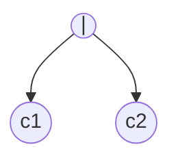
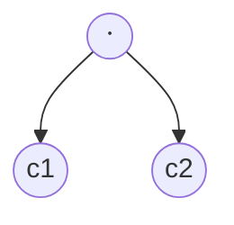
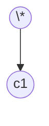

This note is a rendered set of rules for [ECOTE](../projects/ECOTE/ECOTE.md)

## Node types

- $\epsilon$ node

- non-$\epsilon$ node

- **or** node

- **concat** node

- **closure** node

## Functions

- **Null-able(n) Algorithm**
  - **ε node at i position**: **true**
  - **Non-ε node at i position**: **false**
  - **Or node**: `null-able(c1) $\vee$ null-able(c2)`
  - **Concat node**: `null-able(c1) $\wedge$ null-able(c2)`
  - **Closure node**: **true**

- **first(n) Algorithm**
  - **ε node at i position**: return $\emptyset$
  - **Non-ε node at i position**: return $i$
  - **Or node**: first(c1) $\cup$ first(c2)
  - **Concat node**: nullable(c1) ? (first(c1) $\cup$ first(c2)) : first(c1)
  - **Closure node**: first(c1)

- **last(n) Algorithm**
  - **ε node at i position**: return $\emptyset$
  - **Non-ε node at i position**: return $i$
  - **Or node**: last(c1) $\cup$ last(c2)
  - **Concat node**: nullable(c2) ? (last(c1) $\cup$ last(c2)) : last(c2)
  - **Closure node**: last(c1)

- **follow(i) Algorithm**
  - **ε node at i position**:
  - **Non-ε node at i position**:
  - **Or node**:
  - **Concat node**:
  - **Closure node**:
