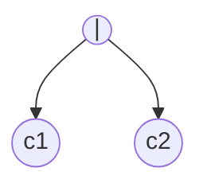
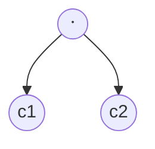
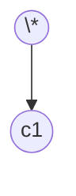

This note is a rendered set of rules for [ECOTE](../projects/ECOTE/ECOTE.md)

## Node types

- $\epsilon$ node

- non-$\epsilon$ node

- **or** node

- **concat** node

- **closure** node

## Functions

| Node Type                    | Null-able(n) Algorithm                 | first(n) Algorithm                                        | last(n) Algorithm                                      |
| ---------------------------- | -------------------------------------- | --------------------------------------------------------- | ------------------------------------------------------ |
| **ε node at i position**     | **true**                               | return $\emptyset$                                        | return $\emptyset$                                     |
| **Non-ε node at i position** | **false**                              | return $i$                                                | return $i$                                             |
| **Or node**                  | `null-able(c1) $\vee$ null-able(c2)`   | `first(c1) $\cap$ first(c2)`                              | `last(c1) $\cap$ last(c2)`                             |
| **Concat node**              | `null-able(c1) $\wedge$ null-able(c2)` | `nullable(c1) ? (first(c1) $\cap$ first(c2)) : first(c1)` | `nullable(c2) ? (last(c1) $\cap$ last(c2)) : last(c2)` |
| **Closure node**             | **true**                               | `first(c1)`                                               | `last(c1)`                                             |

