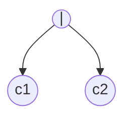
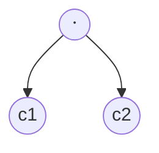
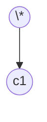

This note is a rendered set of rules for [ECOTE](../projects/ECOTE/ECOTE.md)

## Functions

### Null-able(n)

- $\epsilon$ node: **true**

- non-$\epsilon$ node: **false**

- **or** node: null-able(c1) **or** null-able(c2)

- **concat** node: null-able(c1) **and** null-able(c2)

- **closure** node: **true**

### first(n)

- $\epsilon$ node at $i$ position: $\emptyset$

- non-$\epsilon$ node at $i$ position: $i$

- **or** node: first(c1) $\cup$ first(c2)

- **concat** node:

if nullable(c1):
    first(c1) $\cup$ first(c2)
else:
    first(c1)

- **closure** node:

first(c1)

### last(n)

- $\epsilon$ node at $i$ position: $\emptyset$

- non-$\epsilon$ node at $i$ position: $i$

- **or** node: last(c1) $\cup$ last(c2)

- **concat** node:

if nullable(c2):
    last(c1) $\cup$ last(c2)
else:
    last(c2)

- **closure** node:

last(c1)

