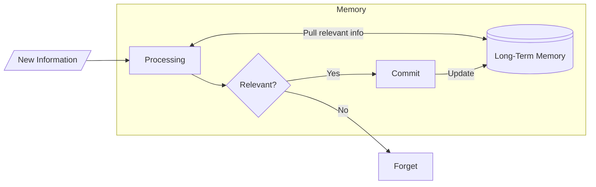

Our brain works really hard to forget the the stuff that is irrelevant. 

Main goal of learning is to encode the knowledge such that it is 

easy to retrieve and use later.

Following sections are describing how this process can be optimized with 

**PERRIO system**.

## Priming

Any technique before the main learning activity (lecture/study session)

### Why it works?

Because when we are prompted for some arbitrary knowledge it is hard to retrieve it, 

even if we know it well. In context of the Diagram: it is easier to find relations to 

skew the answers of the "Relevant?" question to "Yes".

## Encoding

Allows the brain to make sense of the information. We organize and relate the information

in relation to what we already know. This includes:

- Grouping
- Simplifying
- Making analogies
- Making connections
- Making evaluations
- etc.

## Reference

Not part of the diagram, but the idea is that if we do not create some kind of mental 

snapshot of what we learned, then we either forget or get overloaded with details.

Neither is useful: create notes for thing that are easy to forget, and focus on making 

the connections. Making it easily accessible later is the hard part

## Retrieval

Pulling information from the long-term memory to the short term memory. But

also, actively rethinking what we just learned. Here, we could also employ

self-testing, to make use of the active thinking more.

## Interleaving

Testing yourself in multiple perspectives. Hitting the problem from multiple angles.

## Overlearning

Holding one self to higher standard then "necessary". In particular: revising the subject

more, improving the retrieval, studying related topic to broaden the context.

While this step is optional, it is good to include it as it will make future easier. 

Ironically, this is often a stage that most ppl start with.
