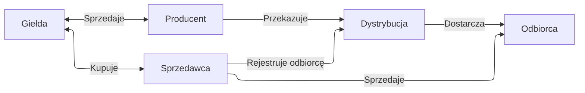

[Batteries Project](../projects/Batteries%20Project.md)

Uproszczony widok na rynek energii w Polsce:

## Giełda

Giełda sama w sobie ma 3 główne rynki:

1. Capacity
2. Energii elektrycznej
    1. Forwards (Year, Quarter, Month, Week)
    2. Day ahead
    3. Intra day
    4. Bilansujący
3. Usług bilansujących
    1. pierwotna
    2. wtórna
    3. trójna
