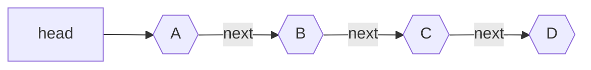

## Definition

A linked list is a [Data Structure](Data%20Structure) that is based on nodes.
Each node holds some `data` and a pointer to `next` node. Each node is stored on
a [Heap](Heap.md) and therefore nodes are spread out across memory. 

> [!Warning]
> Remember! Single Linked List is highly inefficient because of the fact that it's not localized! If insertions and deletions are common and [Array](Array) cannot be used then consider better alternatives such as [Tree](Tree.md) like structure.

## Notation

Example of Single Linked List:

