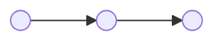
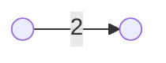

---
categories:
- zettelkasten
date: 2025-02-14
description: No description provided.
tags: []
title: Weighted Graph
---

[Graph](Graph.md)

## Representation

This relation can be related with triplet (u,v,w)

## Intuition

Edges of the graphs contain a certain weight to represent an arbitrary value such as cost, distance, quantity etc.

> [!Notice]
> Weighted Graph is "just" an optimisation of unweighted graph.

If you consider:

It is the same as 

