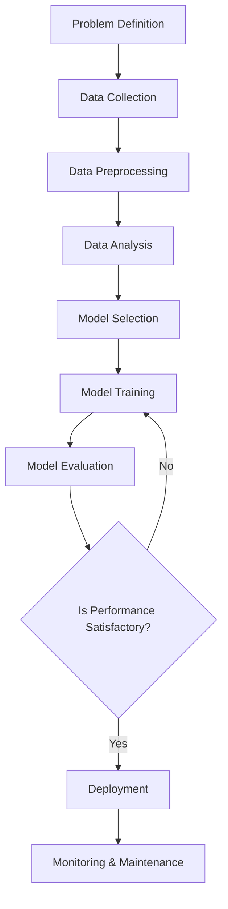

# Gen AI

Krzysztof Watras

---

## Agenda

- Exploration of AI space
- Tools utilizing the GenAI
- Combining AI with tools to build full AI systems
- Case study of the SPA project

---

## Gen AI (Text)

- Generate text by predicting **next token**   (auto-regressive)
- LM training is **data compression**
- Impossible to train to change *specific* behavior (inscrutable artifacts)
- Need application to run the model   (obvious, but important for later)

Notes: The LM compresses the data by creating the internal models of the world. This view is directional. 
There are advances in interpretability, but this field is too young to be relevant in the big scale.

---

## Building AI systems

---

## Usual model

---

LMs are likely to be in the center of the application design philosophy

Note: much like the cpu is the center of the computer, the LMs will be the
center of the app, thus it makes sense that we will take lessons learned and
apply them here

---

> [!Important]
> "AI application" is actually an "application with AI"

--

### What does it mean?

In the big picture, AI is **just another feature**. 

AI by itself is **just an artifact**. You need the ability to connect it with *something*.

Note: Notice: there is AI workflow when building the system. Also: other important features include: security, logging, backups, scalability, compliance (legal), user tutorials.

---

## Prompt Engineering

Techniques proven to work:

- **Prompt Templates**: Using templates that organize the information in a specific formats   (ex. HTML or YAML).
- **Few-Shot Learning**: Providing a few input/output pairs within the prompt to guide the model
on how to perform a specific task.
- **Chain-of-Thought Prompting**: Encouraging the model to generate intermediate reasoning
steps before arriving at a final answer.

--

But you should not attempt to make the prompt yourself (use DSPy instead)

Note: the LMs have been proven to be unstable (tiny prompt changes result in massive perf. boosts).
Unless you are doing some quick scripting to just make it work (or need to leverage some low level functions of the LM provider, that are not available in the DSPy yet)

---

## Promising tools

- Aider
- Claude Code
