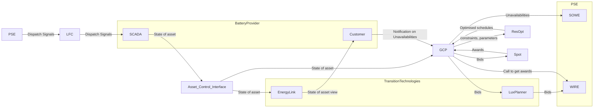

We have following arch: 

## Action Items

- [x] Read the presentation on capacity + reserves in the mail
- [x] Make note on the glossary + environment we work in
- [x] Understand what product we sell
- [ ] Learn DA1 and study the markets in detail
- [x] Go through the code and understand what is going on
- [ ] Read the paper on BESS [important:: false]
- [x] Add tasks to Jira: setup mypy + pytest + coverage
- [ ] Make a unified set of names for the variables and a glossary of what is what

## Progress

### 2025-03-10

I read the presentations and understand the landscape roughly.

Now going through the code and have some

questions:

- Where is the docker command run?
- Why is there "price" and "prod" as targets?
- What is the `prod_path` and `prod_model_forecast_path` for csv files on GCP?

suggestions ad bess_etl:

- I know that the `uv` discussion is ongoing, but I propose we use it, and then if the ans. is still "no" then we migrate to `poetry` (worst case).
- I'd rather do full datetime + POLAND TZ with some explicit default time in case we pass date instead of datetime and do some simple pattern matching on the input.
- Error msg mentions `force_run` flag (`input_validation` method) but this is a feature that does not seem to be implemented
- On Trigger initialization, I'd do asserts if the params implement the interfaces we expect (`isinstance` and `hasattr`)
- `model` property should be `pipeline` | why not add `config` property? If we want to make the `ETLPipelineTrigger` attrs immutable, I'd just use dataclass + frozen=True
- Initialization of options gets quite repetitive, I'd make a class that defines triplet: (`name`, `pipeline`, `config` ). 
    Notice: we are doing name twice: in the config and in the cli call and they are not the same!
- "Config" class hierarchy is way too complex: let's make it simpler with `python-builder` module [link](https://pypi.org/project/python-builder/)
- Same goes for the "Pipeline" class hierarchy. why make so many classes? One class with diff params is better I think. 
    - Why define "default" config if we will always overwrite it?
- `ETLProdModelForecastPipeline` defines the config as being set-able dynamically... But should we not always be able to set the config during `__init__` not after?
- Again: the name should be inferable from config, why set it separately??
- `SequentialPipeline` should be a using `ETLPipelineSteps` instead of the Sequence of steps.
- `SequentialPipeline` should only use `logging`, not `print` to inform of state (and use `perf_counter` not `time`)
- Only just noticed: Pipeline should not inherit from Config! I honestly have no idea why it is done this way...
- Nit: we could make the ETL even more functional if you want (unimportant, but fun for sure!)

questions after:

- will the `models` cli ever be used again? Cuz if it will be then I'd do pretty much the same changes.

## Reflection

What went wrong? Why?
