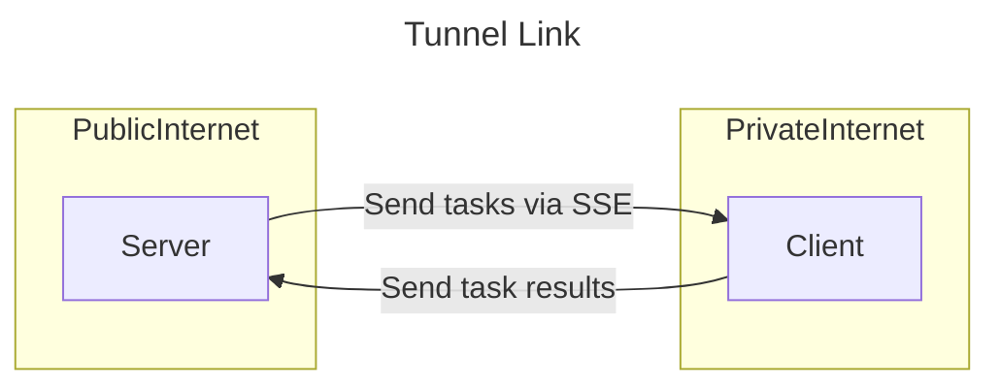

Basically, my solution will be around 2 servers: one private, one public. 
The private server will initiate and restore communication, in case when the connection is lost.
Two servers will communicate via secure HTTP2 connection.
Client will call an endpoint that exposes an SSE stream.
On some events will call an endpoint that will accept an event.
Note: this is not solved well by Kafka or other message brokers cuz we will send arbitrarily large payloads, something Kafka is ill suited for

## Proposed solution

## Action Items

- [ ] Make sure the project is valid
- [ ] Create repo
- [ ] Implement client
- [ ] Implement server
- [ ] Publish with MIT license
