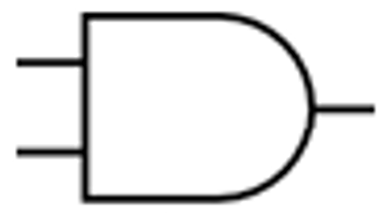

# AND Logic gate ( $\land$ )
[Logic Gates](Logic%20Gates.md)
### Truth Table
[Truth Tables](Truth%20Tables.md)

| P | Q | Result |
| :-: | :-: | :-: |
|0|0|0|
|0|1|0|
|1|0|0|
|1|1|1|

### Math Representation
r = pq

### Symbol Representation

### Properies
1. [Associative binary property](Associative%20binary%20property.md)
2. [Communicative binary property](Communicative%20binary%20property.md)
3. [Distributive binary property](Distributive%20binary%20property.md) with [OR gate](OR%20gate.md)
4. [Absorptive property](Absorptive%20property.md) with [OR gate](OR%20gate.md)

