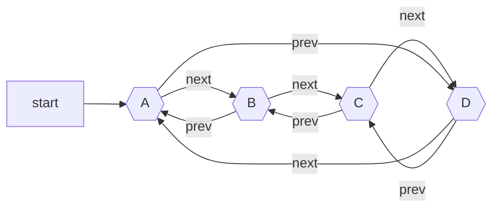
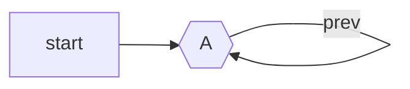

# Circular Doubly Linked List
## Definition
An extension od [Doubly Linked List](Doubly%20Linked%20List.md) also called Doubly Linked Ring.

## Notation

## Code
> [!note]
> In general it'll be easier to implement this using iterators + one extra node that will not be treated as Read-Write node. Instead it'll be used to define begin() and end() iterators.

Such that iterator `end` will be equal to `A` and `begin` will be `A->next`.

#TODO  create this class and add it to github + add link here