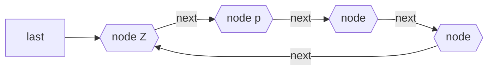

# Circular Singly Linked List
## Definition
An extension of [[Singly Linked List]] that allows for insertions at the beginning as well as at the end without extra pointer for "end". Also called Singly Linked Ring.

## Notation

## Code
#TODO  create this class and add it to github + add link here