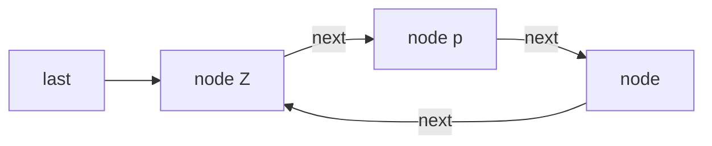

# Circular Singly Linked List
## Definition
Circular singly linked list is an optimization of [[Singly Linked List]] or rather an extension that allows for insertions at the beginning as well as at the end without extra pointer for "end".
## Notation

## Code
#TODO  create this class and add it to github + add link here