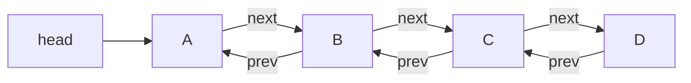

# Doubly Linked List
## Definition
An extension of [[Singly Linked List]]. Difference is that each node holds `data`, `next` pointer AND `prev` pointer. This makes any algorithm modifying the doubly linked list MUCH easier than in singly linked list.

## Notation

## Code
#TODO  create this class and add it to github + add link here