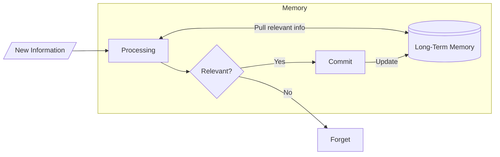

> [!Definition]
> This is some definition text

<span class="letterine"><i>T</i>his is example of span with letterine class.</span>
You need set the `markup.goldmark.unsafe` and `markup.goldmark.renderer.unsafe` parameter in `config.toml` to write html directly, but this is not recommended.

And this is marginpar. 
**Bold text**,
*Italic text*,
***Bold and italic text***,
~~Strikethrough text~~
[Link text](https://example.com)
---also works.

Lorem ipsum dolor sit amet, consectetur adipiscing elit, sed do eiusmod tempor incididunt ut labore et dolore magna aliqua. Ut enim ad minim veniam, quis nostrud exercitation ullamco laboris nisi ut aliquip ex ea commodo consequat. 



Matrix:
 $$M = \begin{bmatrix} 3 & 2 \\ 2 & 4 \\ 4 & 5 \end{bmatrix}$$

## Null space (kernel) or \\(kernel\\)
$var_1$, $e^{-1j}$
\
Working link: [Vector](/Vector)

## Heading 2

First paragraph will not indent.
Lorem ipsum dolor sit amet, consectetur adipiscing elit, sed do eiusmod tempor incididunt ut labore et dolore magna aliqua. Ut enim ad minim veniam, quis nostrud exercitation ullamco laboris nisi ut aliquip ex ea commodo consequat. 

Second paragraph and after will indent.
Duis aute irure dolor in reprehenderit in voluptate velit esse cillum dolore eu fugiat nulla pariatur. Excepteur sint occaecat cupidatat non proident, sunt in culpa qui officia deserunt mollit anim id est laborum.

> This is a blockquote
>> Nested blockquote

### Heading 3

1. Ordered list item 1
2. Ordered list item 2
   - Nested unordered item
   - Another nested item
3. Ordered list item 3

- Unordered list item
- Another item
  - Nested item
  - Another nested item

#### Heading 4


| Header 1 | Header 2 |
|----------|----------|
| Cell 1   | Cell 2   |
| Cell 3   | Cell 4   |

Task list:
- [x] Completed task
- [ ] Incomplete task

##### Heading 5

Here's some `inline code` and some ***combined*** formatting.

Here's some block code:

    // code block with four space
    def hello_world():
        print("Hello, World!")

```js
// Code block with syntax highlighting
function greeting(name) {
    return `Hello, ${name}!`;
}
```

###### Heading 6 

Heading level 6 will show as inline paragraph.
Lorem ipsum dolor sit amet, consectetur adipiscing elit, sed do eiusmod tempor incididunt ut labore et dolore magna aliqua. Ut enim ad minim veniam, quis nostrud exercitation ullamco laboris nisi ut aliquip ex ea commodo consequat.
