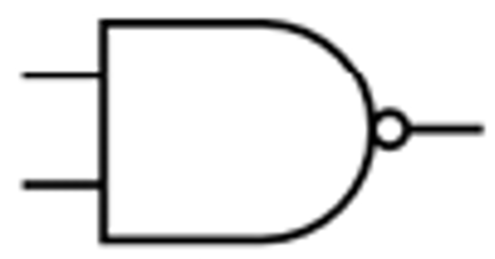

# NAND Logic gate
[Logic Gates](Logic%20Gates.md)

In math known as Shafer Stroke ( $\uparrow$ )

### Truth Table
[Truth Tables](Truth%20Tables.md)
| P | Q | Result |
| :-: | :-: | :-: |
|0|0|1|
|0|1|1|
|1|0|1|
|1|1|0|

### Symbol Representation

