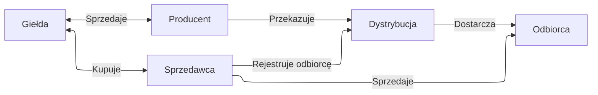

Uproszczony widok na rynek energii w Polsce:

Pytania:
1. czy to jest poprawne^
2. Jak dystrybucja wie że faktycznie mają to opłacone? 
3. Jak działa rynek frequency balance? kto aktywuje baterie - PSE(?)
4. ten projekt jest na 2 rynkach: capacity i freq. balance tak?
    1. jakie są zasady, jakie kary, itp.
5. DA jest opisywany w materiałach jako krótko-terminowy... ale pamiętam że mamy plany na następne LATA - to jest ten sam rynek czy czegoś nie czaję?
6. Staram się zrozumieć Fixing 1. [Ten link](https://www.photonenergy.pl/pl/blog/fixing-i) sugeruje że to nie jest jak "zwykła" giełda, że jak robisz ogłoszenie sprzedaży to jest automatycznie zamknięte,
jak ktoś kupi tylko jest proces cały... nie rozumiem tego raczej.

## Giełda

Giełda sama w sobie ma 3 główne rynki:

1. Capacity
2. Energii elektrycznej (SPOT?)
    1. Day ahead
    2. Intra day
3. Usług bilansujących
    1. pierwotna
    2. wtórna
    3. trójna