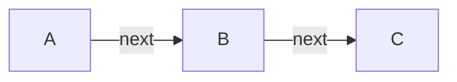

# Linked List
## Definition
A linked list is a [[Data Structure]] that is based on nodes. Each node holds some `data` and a pointer to `next` node. 

## Notation
Example of Single Linked List:

## Code
> [!Warning]
> Remember! Single Linked List is highly inefficient because of the fact that it's not localized! If insertions and deletions are common and [[Array]] cannot be used then consider better altenatives like [[]]