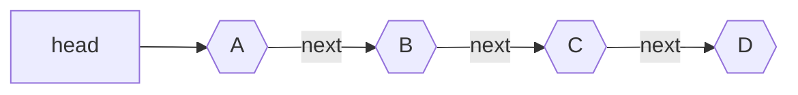

# Singly Linked List
## Definition
A linked list is a [[Data Structure]] that is based on nodes. Each node holds some `data` and a pointer to `next` node. Each node is stored on a [[Heap]] and therefore nodes are spread out across memory. 

> [!Warning]
> Remember! Single Linked List is highly inefficient because of the fact that it's not localized! If insertions and deletions are common and [[Array]] cannot be used then consider better alternatives such as [[Tree]] like structure.

## Notation
Example of Single Linked List:

## Code
If you REALLY need to use it then consider built-in data structure for your language.
Table that of names for those in different languages

| Language | Name                                    | library/module                                                                                                  |
| -------- | --------------------------------------- | --------------------------------------------------------------------------------------------------------------- |
| C        | Lol, yes, you will build it by yourself | or use solution in [this repo](or use [this repo solution](https://github.com/mkirchner/linked-list-good-taste) |
| C++      | `std::forward_list`                     | `#include<forward_list>`                                                                                        |
| Other    | ?                                       | ?                                                                                                               |
